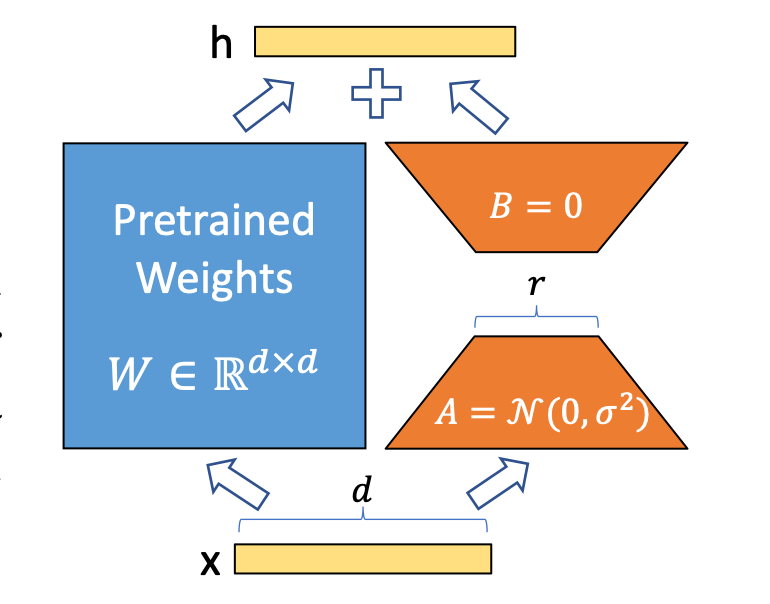

# Lightweight Fine-Tuning Project

This notebook demonstrates the implementation of a computationally efficient method to customize an open-source project for a specific use case. While the demonstrated task is **sentiment classification**, any task available on Hugging Face can be inferred, trained, or customized using the platform's available task-specific models.

## PEFT Technique: LoRA (Low-Rank Adaptation)

### Explanation of LoRA Working Mechanism
Low-Rank Adaptation (LoRA) is a technique used to reduce the number of trainable parameters in a model by decomposing the weight matrices into lower-rank matrices. The matrices' parameters are small because matrix multiplication is applied, hence two small matrices allow storing a large amount of information like in one large matrix.

For more details, refer to the original paper: [LoRA: Low-Rank Adaptation of Large Language Models](https://arxiv.org/pdf/2106.09685) by Edward J. Hu et al. 2021.

The second main advantage of LoRA is that the pretrained layers are kept untouched, which is important because those layers have been trained on a vast amount of data. More specifically, BERT was trained on the BookCorpus dataset (800M words) and English Wikipedia (2,500M words). Hence updating the foundation models weights and biases on the basis of a training dataset of e.g. 10 0000 words would be unreasonable and imply the risk of **catastrophic forgetting**.

This lora approach of not training the pretrained layers  prevents catastrophic forgetting. For more information, see this paper: [An Empirical Study of Catastrophic Forgetting in Large Language Models During Continual Fine-tuning](https://arxiv.org/pdf/2308.08747) by Yun Luo et al. 2023.

### Model
- **Model Used**: `bert-base-uncased`
- **Technique**: LoRA (Low-Rank Adaptation)

### Evaluation Approach
- **Metrics**: Accuracy and Inference Sanity Checking

### Fine-Tuning Dataset
- **Dataset**: `stanfordnlp/sentiment140`

## Loading BERT Model

BERT (Bidirectional Encoder Representations from Transformers) is a transformer-based model designed for natural language understanding tasks, and particularly primed for Sentiment Analysis tasks. It uses a bidirectional approach to read text, meaning it considers the context from both the left and right sides of a word, providing a deeper understanding of context.

## Sentiment140 Dataset from Hugging Face

Sentiment140 is a good dataset for demonstrating and building sentiment analysis models for several reasons:

- **Size**: It contains 1.6 million labeled tweets, providing a large amount of data for training robust models.
- **Real-world Data**: The dataset consists of tweets, which are real-world, noisy text data, making it a good representation of actual user-generated content.
- **Binary Sentiment Labels**: It has clear binary sentiment labels (positive and negative), simplifying the classification task.
- **Preprocessed**: The dataset is preprocessed to remove common noise in tweets (like URLs and usernames), making it easier to work with.
- **Publicly Available**: It is freely available, allowing easy access for experimentation and learning.